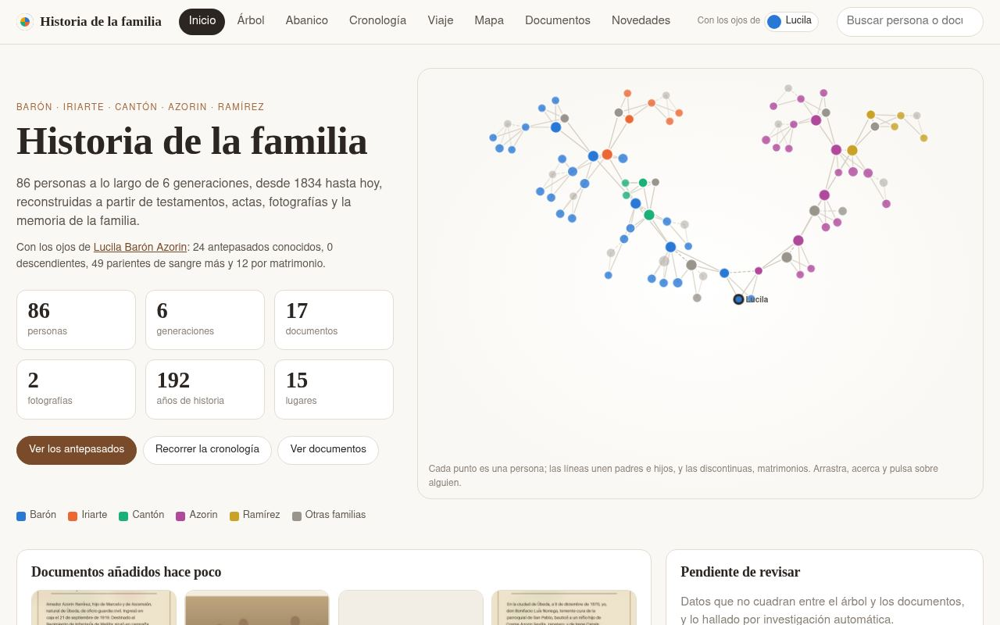
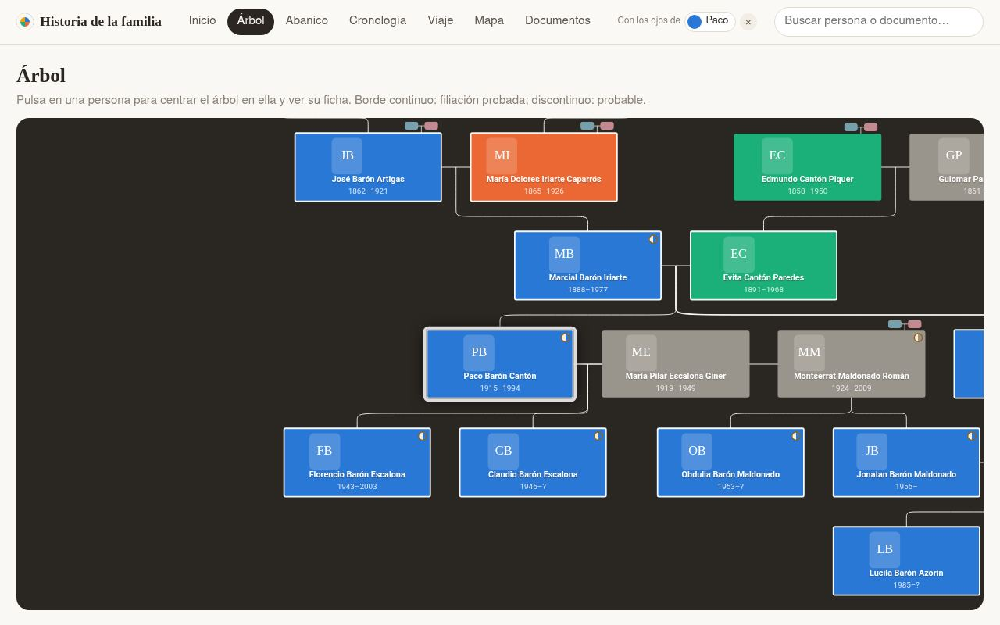
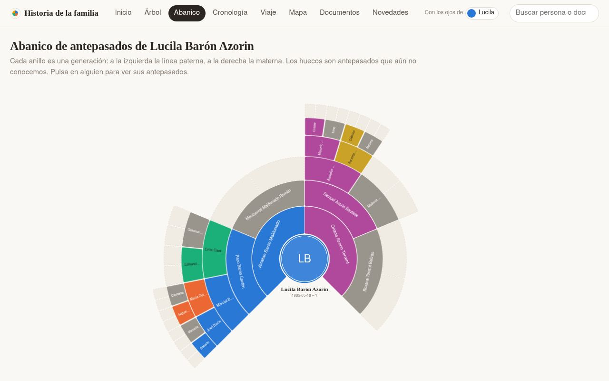
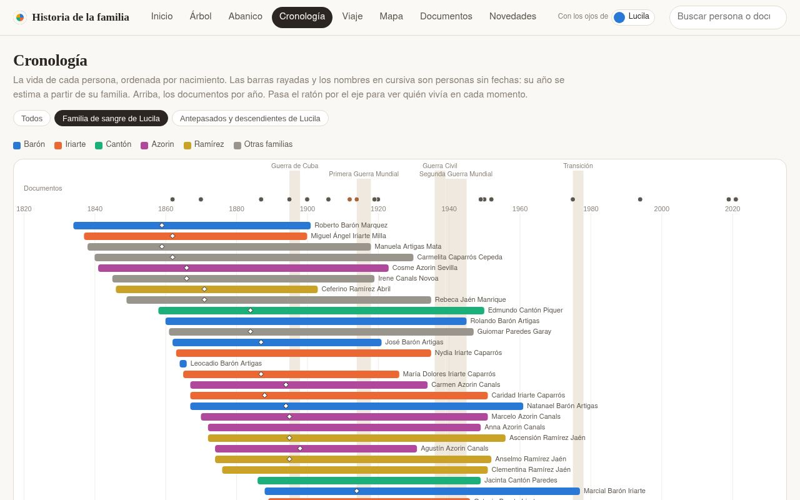
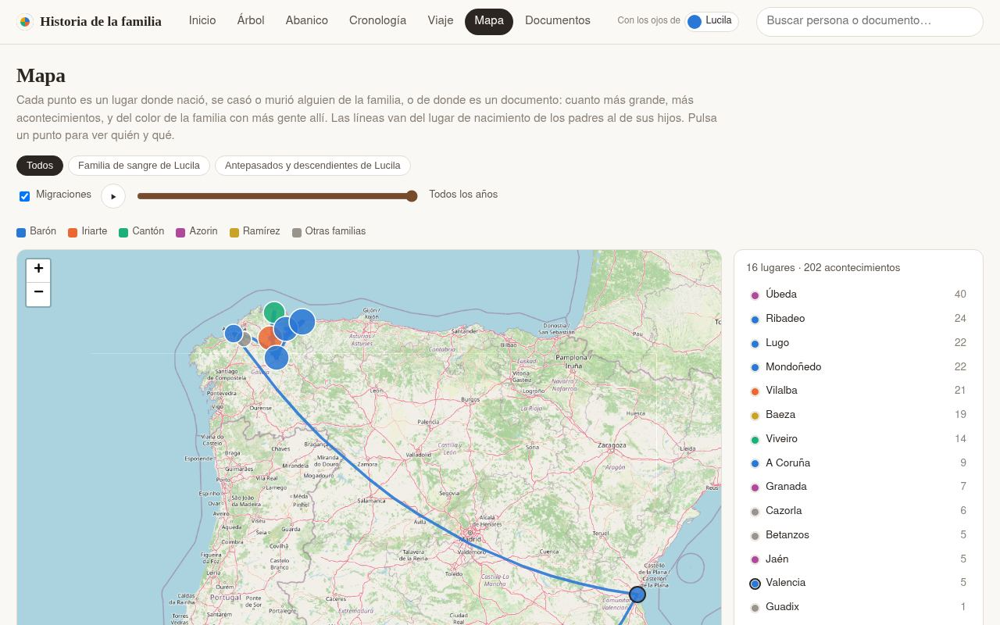
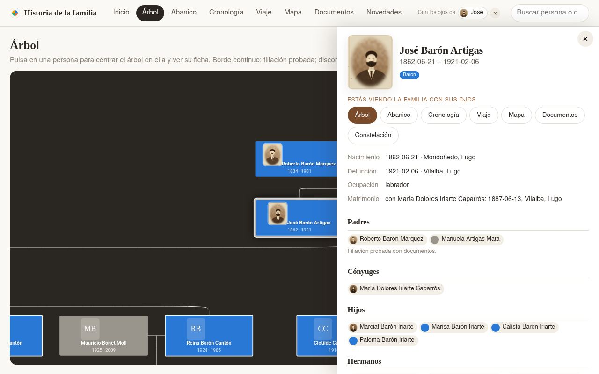
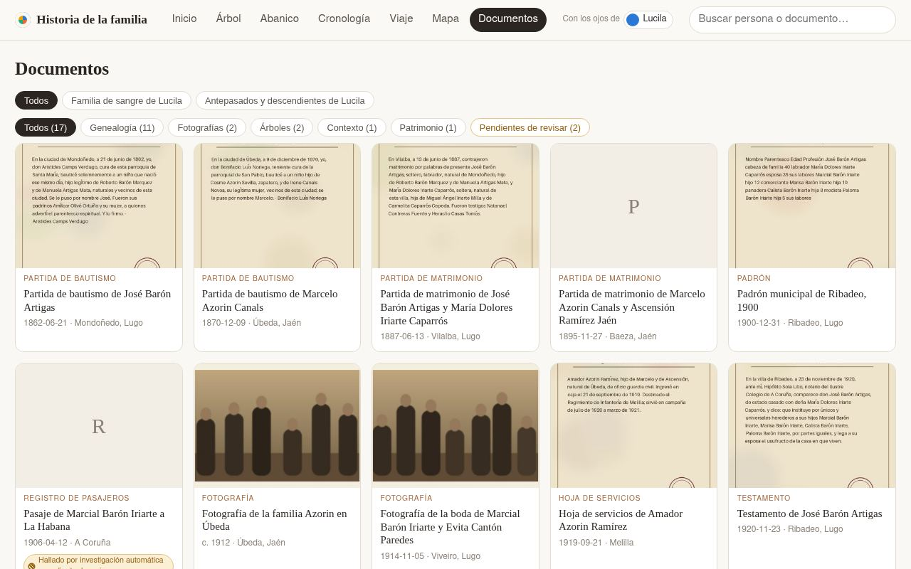
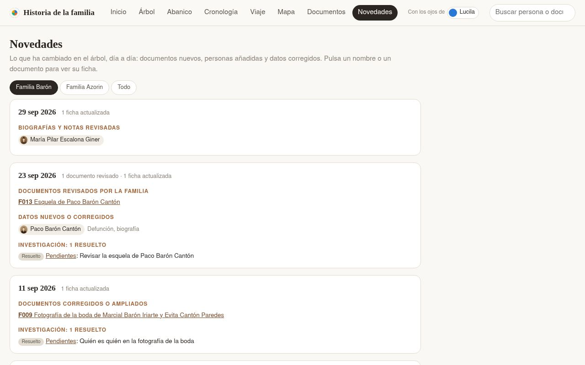

🇪🇸 [Léelo en castellano](README.es.md) — the website is currently in Spanish (see [Language](#language))

# Family tree kit

## Start your tree

> **Never used an AI agent?** An agent is an assistant like ChatGPT or Claude that works directly with the files on
> your computer: it reads your documents, writes the notes and builds the website for you. The easiest way is to
> install the [Claude](https://claude.com/download) desktop app and use its **Code** tab (or
> [Claude Code](https://claude.com/claude-code), if you are at home in a terminal), pick a folder on your computer and
> paste the text below. From then on everything is done by talking to it in your own language: no programming, no
> terminal, no git knowledge needed. At the start it asks whether you have used these tools before and, if not,
> explains everything without jargon.

Paste this into an AI coding agent (Claude Code, Codex…), opened in the folder where you keep your projects. It
only needs git: no GitHub account.

```text
Start a family tree for me with the kit elboletaire/family-tree-kit.

1. Ask me what to call the folder (suggest "family-tree"), then run
   `git clone https://github.com/elboletaire/family-tree-kit <folder>` and enter it.
2. Rename the remote: `git remote rename origin kit`. It is not where my tree is kept: it only brings updates of the
   kit, and nothing is ever pushed to it.
3. Read AGENTS.md. Check that uv, Node 22 or later and pnpm are installed, and help me install what is missing.
4. Start the tree with the start-tree skill (.agents/skills/start-tree/SKILL.md): it asks me where to keep the
   tree, interviews me, creates the first people and families.yml, and builds the website.
```

Before that, you can look around the **[demo](https://elboletaire.github.io/family-tree-kit/)**: the website of a
fictional family, made up by `scripts/demo.py`.

## What it is

A family tree kept as a code repository: **one markdown note per person** (relations in the frontmatter, biography
below) and **one per document** (transcription, with the scans next to it). Every change stays in the git history,
every fact cites the document it comes from, and a set of scripts checks the tree and turns it into a website:
a tree you can browse, a fan chart of ancestors, a timeline, a "journey in time", a map of the family's places, a
gallery of documents and the tree's news (what changed, day by day, read from the git history of the data), all seen
"through the eyes" of whoever you choose. The website can be published with the living
hidden (and everything else behind a password).

It is meant to be worked on with an AI coding agent (Claude Code, Codex…): the agent interviews you, transcribes the
documents you hand it, keeps the notes consistent and runs the checks. `AGENTS.md` is its contract, and the skills in
`.agents/skills` are its workflows.

### Screenshots

From the [demo](https://elboletaire.github.io/family-tree-kit/) (`make screenshots` takes them again):

| | |
|---|---|
|  |  |
| **Home**: the family at a glance | **Tree**: parents, marriages, children |
|  |  |
| **Fan chart** of ancestors | **Timeline** of lives, documents and historical events |
|  |  |
| **Map** of the places and migrations | A **person's card**: facts, relatives, documents |
|  |  |
| **Documents**, with those pending review | **What's new**: what changed in the tree, day by day |

## Start by hand

Without the prompt above, the same steps:

1. `git clone https://github.com/elboletaire/family-tree-kit family-tree`, `cd family-tree` and
   `git remote rename origin kit`: `kit` is where the updates of the kit come from, not where your tree is kept.
2. Install the requirements (below) and the `pre-push` hook (`make hooks`), which, among other things, refuses a push
   of your tree to `kit`.
3. Open your agent in the folder and say **"I want to start my tree"** (in any language). With no `families.yml`, it
   follows the `start-tree` skill: it asks which language the tree is written in, interviews you about yourself
   (and whether you have anything to start from: a tree someone began, funeral cards… none is fine too), your parents
   and your grandparents, a few questions at a time, and creates the first notes, `families.yml` and `TREE.md` (the
   conventions of your own tree). You see the website as soon as your parents are in, and where to keep the tree is
   asked at the end.
4. `make html` and open `build/web/index.html`.

**Where to keep it**: only on your computer (with a backup: a copy of the folder in a cloud drive, an external
disk…), in a **private** GitHub repository, or on another Git server you already have. **Never public**: the tree
holds names, dates and places of living people and scans of the family's documents; the website has its own public
version, generated without the living (see "Publishing the website").

The repository is also a GitHub template, and **Use this template** works, but a clone is better: it shares the kit's
history, so its updates arrive as normal merges. A copy made with the button has an unrelated history, and its first
update needs `git merge --allow-unrelated-histories` and resolving by hand every file that changed since.

The skills live in `.agents/skills`; `.claude/skills` is a symbolic link to it so that Claude Code finds them. On
Windows, git only creates symbolic links with `core.symlinks=true` and Developer Mode (or an administrator shell);
otherwise, work inside WSL, or copy `.agents/skills` to `.claude/skills`.

| Skill | What it does |
|-------|--------------|
| `start-tree` | Starts a tree from nothing: interview, first people, `families.yml`, `TREE.md` |
| `add-document` | Transcribes a document or photo, creates its source note and updates the people in it |
| `family-interview` | Prepares questions for a relative and turns their answers into a source |
| `genealogy-research` | Searches newspaper archives, gazettes, archive catalogues… and records what it finds as pending sources |

## Requirements

- [uv](https://docs.astral.sh/uv/) (it installs the Python dependencies by itself).
- [Node](https://nodejs.org/) 22 or later and [pnpm](https://pnpm.io/), for the website.
- [Git LFS](https://git-lfs.com/), for the originals (`git lfs pull`).
- Optionally, [Obsidian](https://obsidian.md/): open the repository folder as a vault. The graph view shows the
  connections, each note shows who links to it (children appear in the backlinks), and `templates/persona.md` is the
  template for a new person.

## Main commands

| Command | What it does |
|---------|--------------|
| `make folders` | Creates the data folders named in `families.yml` (`paths`) |
| `make validate` | Regenerates the generated sections and checks links, dates, spouses, files and cycles |
| `make html` | The whole website in `build/web/index.html` (opens without a server) and the site, `build/public/` and `build/private/` |
| `make gedcom` | `build/arbre.ged`, to import in Gramps, MyHeritage, FamilySearch… |
| `make public` | Only what is shared outside the family: the site and `build/arbre-publico.ged`, without the living |
| `make report` | The research documents (incoherencias, pendientes) in PDF, to review on paper |
| `make places` | Looks up the coordinates of new places for the map (OpenStreetMap's Nominatim) |
| `make test` · `make e2e` | Tests of the scripts, the server and the interface; smoke tests in a browser |
| `make check-template` · `make hooks` | No family names in the engine's files; the `pre-push` hook that checks it |
| `make demo` · `make screenshots` | The demo's fictional tree and its website in `build/demo`; the screenshots of this README |

The full conventions (fields, dates, confidence levels, photos, what is public) are in [AGENTS.md](AGENTS.md).

## Adding or correcting someone

1. Create `people/name-surname1-surname2.md` (in Obsidian: a new note in the people folder, and insert the
   «persona» template).
2. Fill in the frontmatter. Parents and spouses are linked with `"[[their-file]]"`; children are **not** written,
   they come from the children's own notes.
3. A spouse goes in `spouses` of **both** notes.
4. Say where each fact comes from in `sources` (and create the note in the sources folder if it is a new document).
5. `make validate` must end with 0 errors.

## Places and map

The **Map** view puts a point on each place where someone was born, married or died, or where a document is from:
bigger the more facts, and in the colour of the branch with most people there. Lines go from each parent's birthplace
to their children's (migrations); a year control shows what had happened up to a year. The background is
OpenStreetMap tiles (without network, an approximate coastline and the points anyway).

Places are free text, so their coordinates are kept apart, in `places.yml`, one line per way of writing them:

```yaml
"Vilanova (Barcelona)": {lat: 41.22, lon: 1.72, name: "Vilanova"}  # what Nominatim found
"Por teléfono": {skip: true}       # not a place: not on the map
"Can Puig, Vilanova": {}           # not found: add lat/lon by hand, or skip
```

`make places` looks up the missing ones, one request per second, and appends their lines; what was corrected by hand
is never touched. Check what it finds: small villages and homonyms (each line's comment says which place it is).

## Publishing the website

It is **one website**, which can be **closed** (the default) or **public**:

- **Closed** (`PUBLIC_SITE=0`, or no line, in `.env`): without the family's password nothing is seen but a page that
  asks for it. Inside, the whole tree; the open **lock** in the top bar closes the session.
- **Public** (`PUBLIC_SITE=1`): visitors see the tree without anything of the living and only the public documents;
  with the **lock** and the password, everything, in the same view.

**What is public**: the deceased, with their dates, places, portrait and biography (without research notes). A
person counts as **living** if their note says `living: true` or if their death is not recorded and they were born
**less than 100 years ago** (without a birth date, it is estimated from their family; if it cannot be, they are
treated as living). Each living person is only a «Persona viva» box in their place in the tree. Documents **more than
100 years old that neither cite nor name anyone alive**, only their transcription and thumbnail; scans and PDFs,
always with the password. Nothing of the research documents. In **Novedades** (what's new), only the changes to
deceased people and public documents. When the website is built, a **leak check** searches
every public file for the names, dates and places of the living: if it finds anything, the build fails and nothing is
published.

`docker-compose.yml` runs a small server (`deploy/server.py`, Python's standard library only) behind Traefik:

```sh
git lfs pull                       # the originals, not only the pointers
cp .env.example .env               # and fill in DOMAIN, SITE_PASSWORD and SOURCES_DIR (paths.sources)
docker compose run --rm build      # builds build/public and build/private (or `make public` with uv, Node and pnpm)
docker compose up -d --build
```

The password (`SITE_PASSWORD`) gives a signed cookie valid for `SESSION_DAYS` days from the last visit; changing it (or `SESSION_SECRET`)
closes every session. After 5 failed attempts from an IP, each attempt waits twice as long, and there is an hourly
limit. The site asks search engines not to index it. To update the website, build `build/public` and `build/private`
again: the container reads `build/` mounted, without rebuilding.

### Automatic deployment

On the server, the repository is *bare* and **its name ends in `.git`**. The hook
[`deploy/post-receive`](deploy/post-receive) deploys `main` into the `web/` folder next to it on every push: checkout
without LFS, each original replaced by a **hard link** to its object in `repo.git/lfs/objects` (so they take disk
space once), and the website rebuilt with Docker. If the leak check finds anything, the push ends with an error and
the previous version stays published. To install it, inside the bare repository:

```sh
git show main:deploy/post-receive > hooks/post-receive && chmod +x hooks/post-receive
```

The `.env` goes in `web/` (the deploy does not touch it).

## Updating the kit

The kit keeps improving (fixes, new views, new checks). To bring those changes into your tree, tell your agent
**"update the kit"**: following `AGENTS.md`, it fetches the `kit` remote, merges it (`git pull kit main`), resolves the
conflicts if you changed any engine file yourself, and runs `make validate` and `make test`. Your data never conflict:
the kit has none.

## The demo

`make demo` writes a fictional tree with `scripts/demo.py` (in `build/demo-tree`: two families of Galician and
Andalusian villages, six generations, living people, documents with their transcriptions and drawn scans, research
items) and builds its whole website in `build/demo`, with the scans next to it. It never touches your own tree, and
the output is always the same. `make screenshots` takes the screenshots of this README from it.

The workflow [`.github/workflows/demo.yml`](.github/workflows/demo.yml) runs `make demo` on every push to `main` and
publishes `build/demo` on GitHub Pages. It **only runs in the template itself** (`elboletaire/family-tree-kit`): in
your copy the jobs are skipped, so nothing of yours is ever built or published by it, and you can leave the file as it
is (or delete it).

## Language

Today the website, and everything the scripts write (generated sections, research review, report, GEDCOM), are only
in **Spanish**: it is the only language the engine has so far. **Translations are welcome**: adding a language takes
two files, and a pull request with them would make the kit useful to many more families.

- It is configurable: `language` in `families.yml` picks `scripts/i18n_<language>.py` and
  `web/src/i18n/<language>.ts`, and `paths` names the data folders (by default `people`, `sources`, `research` and
  `portraits`), so a tree can keep its folders in its own language.
- Some things stay in Spanish whatever the language: the URL segments of the views (`#arbol`, `#abanico`, `#mapa`…,
  `VIEW_SEGMENT` in `web/src/router.ts`), the values of the fields (`pendiente`, `revisada`, `genealogia`, `rama/`…)
  and the date qualifiers (`c.`, `antes de`, `después de`, `¿…?`).
- To add a language, translate those two `i18n` files (and add it to `LANGUAGES` in `web/src/i18n/index.ts`), and
  open a pull request.

## License

[MIT](LICENSE).
